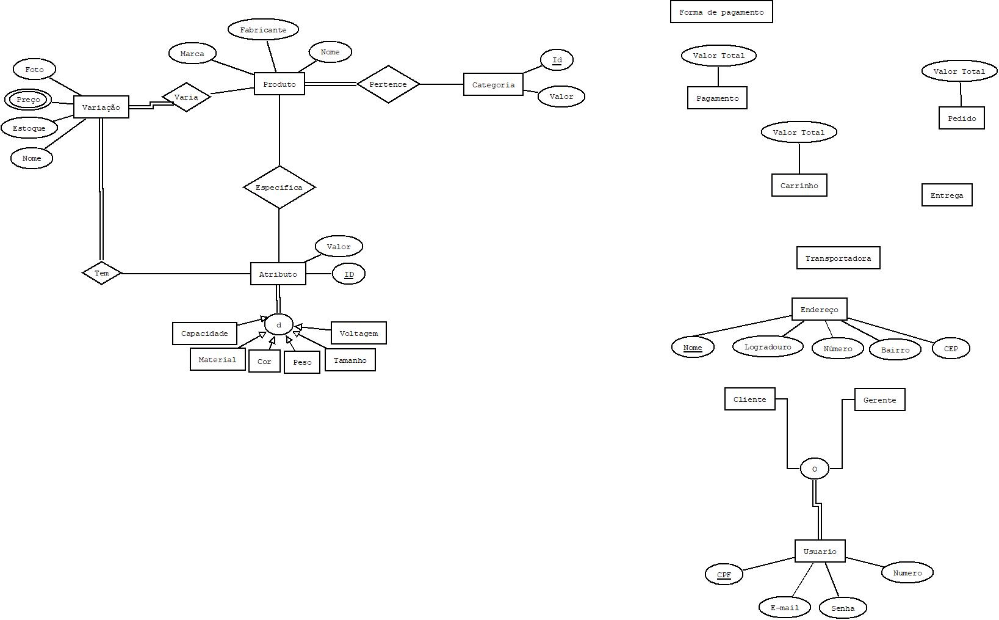

# Modelagem ER/EER - Banco de Dados

Este repositório está na fase inicial do projeto e contém a modelagem ER/EER do banco de dados.

## Versão atual

- README: v2
- Arquivo da modelagem: `ecommerce1.dia`

## Diagrama da modelagem

## Histórico de versão do README

| Versão | Data       | Descrição                                     |
|--------|------------|-----------------------------------------------|
| v2     | 2026-03-25 | Inclusão da imagem da modelagem e versionamento |
| v2.1   | 2026-03-26 | Adicionado variação e atributo de produto, assumindo categoria como uma única entidade |

